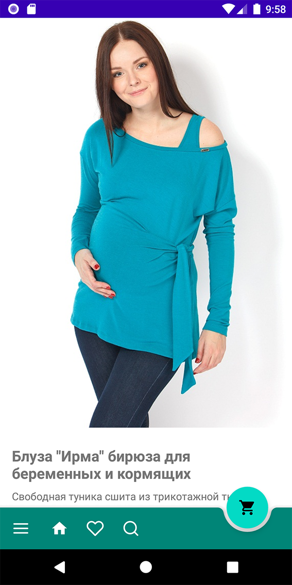

# Shop
Приложение интернет-магазина, использующее в качестве бэка аккаунт на сервисе "МойСклад" и предоставляемое им обширное api для доступа к данным.

Находится в состоянии разработки. 

## Список категорий

Список категорий подгружается динамически в соответствии со структурой категорий товаров в МойСклад, поддерживает три уровня вложенности.

Сразу про нижнее меню - поиск и избранное не реализованы

## Товары в категории

## Карточка товара

Кнопка "в избранное" добавляет товар в корзину в соответствии с выбранным размером.

Внизу ссылки на шесть просмотренных недавно товаров.

## Корзина

## Геозона на карте

Метка на гуглкарте с оффлайн-магазином. 

Реализована геозона - приближение к магазину на рассьляние менее 200 метров, пользователю приходит пуш нотификация с сообщением об этом факте.
